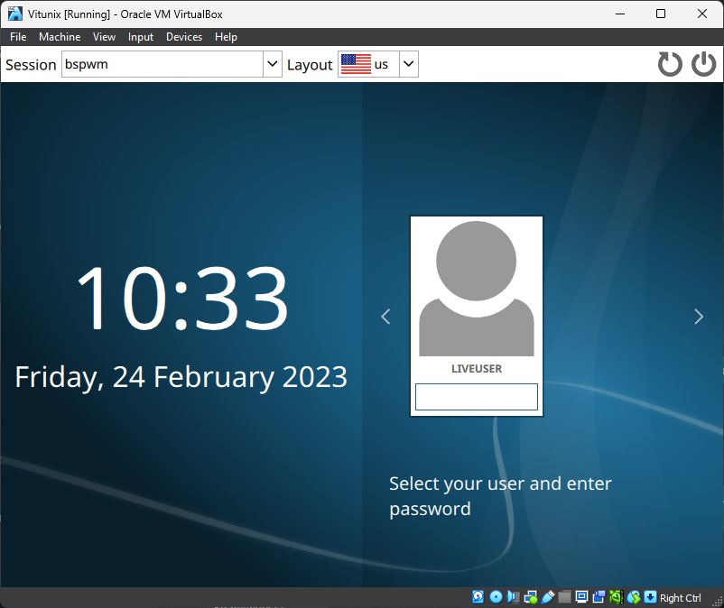

# Installation of vitunix in virtual box

### Download vitunix - https://drive.google.com/file/d/1Z8MsTfvnJO2_R41st14tB9l4Te_Hpd4l/view?usp=sharing

### Download virtual box - https://www.virtualbox.org/wiki/Downloads


```
Install the virtual box then open the virtual box and click on new
```

<td>
      
</td>


```
Fill this fields: 
Name - Vitunix
ISO Image - [ Path of the iso file ]
Type - Linux
Version - Arch Linux (64-bit)
```
<td>
      
</td>

```
Give the memory size and click on create
Min Base Memory - 3000 MB
Min Processor - 2CPU
```
<td>
      
</td>

```
Give minimum 30 GB of hard disk space
```
<td>
      
</td>

```
Then you will see successfull installation of vitunix in virtual box
```
<td>
      
</td>

```
Click on start and bootmenu will appear Select first option (Default) and press enter
```

<td>
      
</td>

```Login Screen
Password - Liveuser
```
<td>
      
</td>

