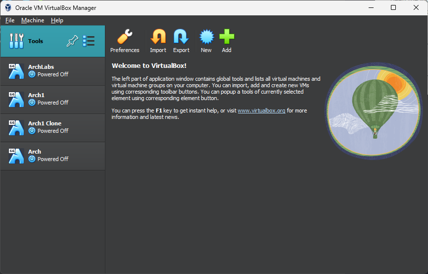
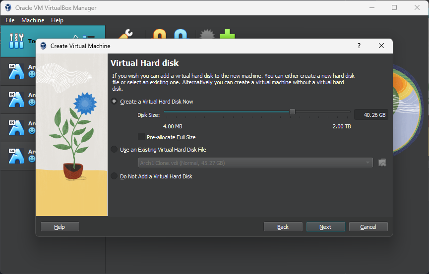
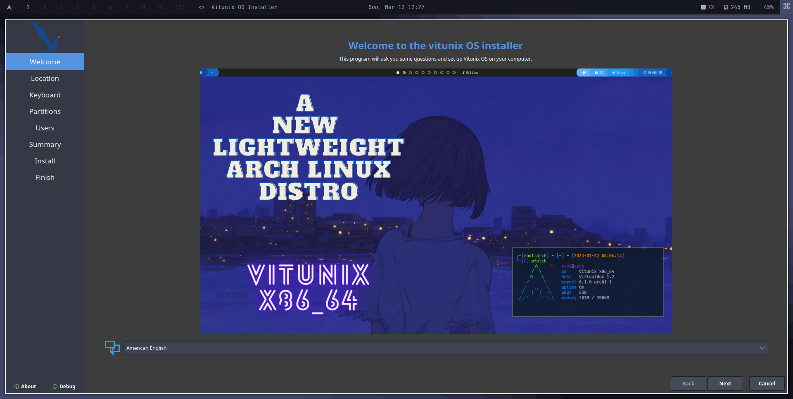
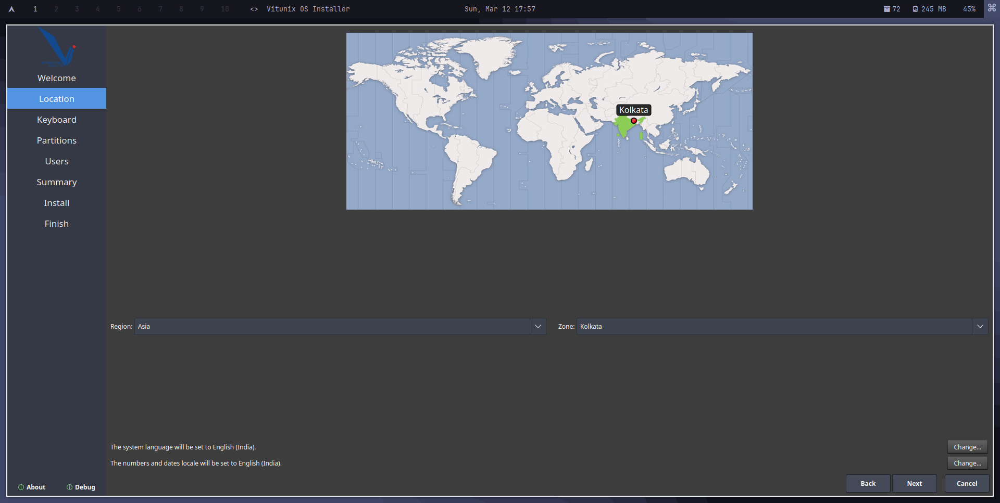
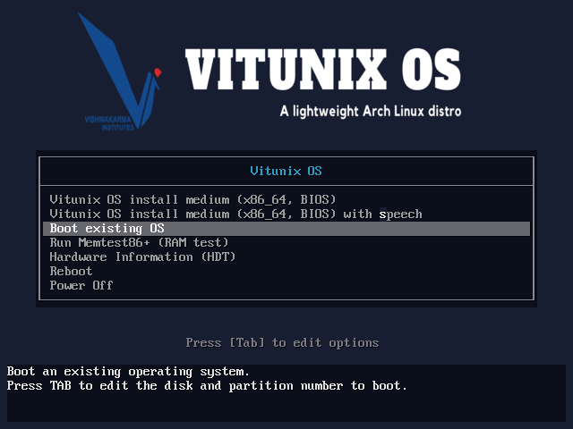
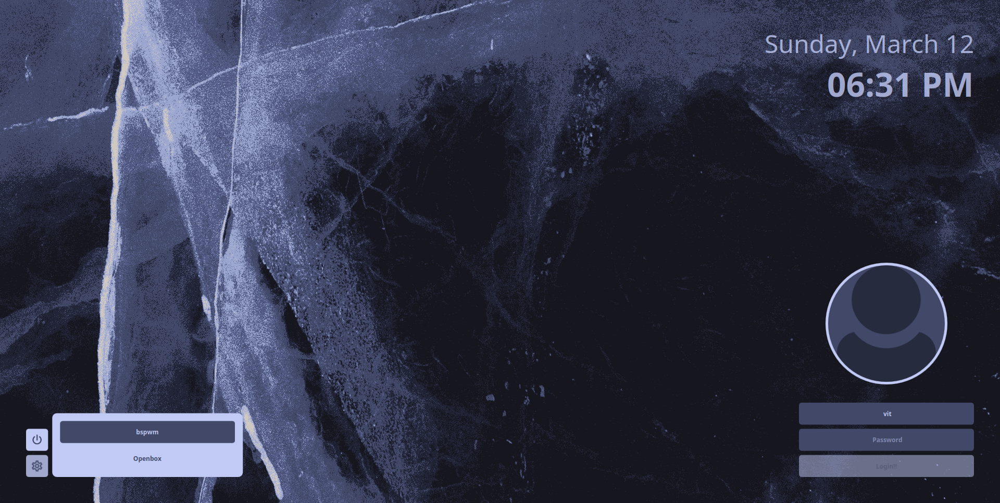

# Installation of vitunix in virtual box

```
Install the virtual box then open the virtual box and click on new
```
<td>
      
</td>

<br />
<br />

```
Fill this fields: 
Name - Vitunix
ISO Image - [ Path of the iso file ]
Type - Linux
Version - Arch Linux (64-bit)
```
<td>
      
</td>

<br />
<br />

```
Give the memory size and click on create
Min Base Memory - 3000 MB
Min Processor - 2CPU
```
<td>
      
</td>

<br />
<br />

```
Give minimum 30 GB of hard disk space
```
<td>
      
</td>

<br />
<br />

```
Then you will see successfull installation of vitunix in virtual box
```
<td>
      
</td>

<br />
<br />

```
Click on start and bootmenu will appear Select first option (Default) and press enter
```
<td>
      
</td>

<br />
<br />

```
Login Screen
Password - Liveuser
```
<td>
      
</td>

<br />
<br />

```
Press Ctrl+D to open the menu
and go Install Vitunix OS
```
<td>
      
</td>

<br />
<br />

```
Select your language
```
<td>
      
</td>

<br />
<br />

```
Then Region and Zone
```
<td>
      
</td>

<br />
<br />

```
After that select your keyboard layout
```
<td>
      
</td>

<br />
<br />

```
Choose your partition
```
<td>
      
</td>

<br />
<br />

```
Enter username, password and hostname
```
<td>
      
</td>

<br />
<br />

```
After filling out basic information summary will get displayed
```
<td>
      
</td>

<br />
<br />

```
Then installation will start. It will take around 5-10 minutes
```
<td>
      
</td>

<br />
<br />

```
After successfull installation restart the system
```
<td>
      
</td>

<br />
<br />

```
Select 3rd option and press enter
```
<td>
      
</td>

<br />
<br />

```
If you pressed settings on lock screen you will get option to chose windows manager
```
<td>
      
</td>

<br />
<br />


```
Enter the password and your installation is complete.
```
<td>
      
</td>

<br />
<br />